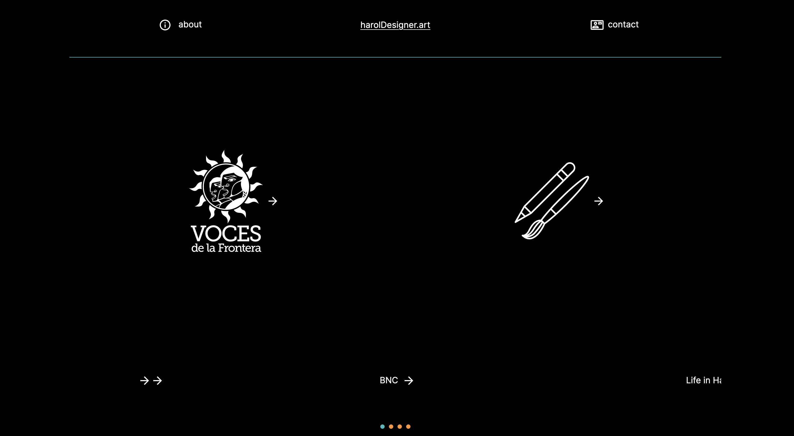

# My Graphic Design Portfolio

**Deployment:** [haroldesigner.art](https://www.haroldesigner.art/)

**Welcome to my graphic design portfolio**, a dynamic showcase built with Next.js. This portfolio highlights my work in various graphic design areas, leveraging the latest tools and libraries to provide an engaging user experience.

## Some of the technologies used:

- **Cloudinary:** Integrated for efficient image management and optimization.
- **HeadlessUI:** Utilized for building fully accessible UI components.
- **TanStack (React Query):** Employed for efficient server-state management in React applications. 
- **Nodemailer:** Integrated for easy email sending through Node.js. .

## Features

- **Dynamic Image Gallery:** Powered by Cloudinary, the gallery showcases my graphic design work with high performance and flexibility.
- **Contact Form:** Built with Nodemailer, allowing easy and direct communication with potential clients or collaborators.
- **Responsive Design:** Ensures a seamless experience across various devices and screen sizes.
